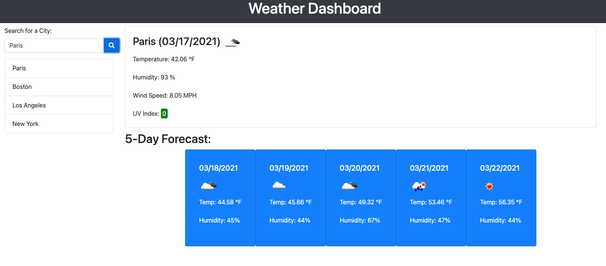

# Weather Dashboard

## Description

I built this app so that the user could search a city and find out the current weather for that day in that city, as well as the 5 day forecast. Now no matter where the user is, they can find out the weather at over 200,000 cities all over the world. During the course of developing this app I learned how to call one API and get information to be used in a second API call. I also learned that I really need to start working on my Javascript layout because turning code into a big pile of spaghetti is easier than you think.

You can link to the app [HERE](https://petermodavis.github.io/weather-dashboard/)

## Usage

Just enter the name of the city you'd like to see the current and five day weather forecast for and it will be displayed next to the search bar.

## Credits

[Moment.js](https://momentjs.com/)  
[Open Weather API](https://openweathermap.org/api)

## License

MIT License

Copyright (c) [2021] [Peter MoDavis]

Permission is hereby granted, free of charge, to any person obtaining a copy
of this software and associated documentation files (the "Software"), to deal
in the Software without restriction, including without limitation the rights
to use, copy, modify, merge, publish, distribute, sublicense, and/or sell
copies of the Software, and to permit persons to whom the Software is
furnished to do so, subject to the following conditions:

The above copyright notice and this permission notice shall be included in all
copies or substantial portions of the Software.

THE SOFTWARE IS PROVIDED "AS IS", WITHOUT WARRANTY OF ANY KIND, EXPRESS OR
IMPLIED, INCLUDING BUT NOT LIMITED TO THE WARRANTIES OF MERCHANTABILITY,
FITNESS FOR A PARTICULAR PURPOSE AND NONINFRINGEMENT. IN NO EVENT SHALL THE
AUTHORS OR COPYRIGHT HOLDERS BE LIABLE FOR ANY CLAIM, DAMAGES OR OTHER
LIABILITY, WHETHER IN AN ACTION OF CONTRACT, TORT OR OTHERWISE, ARISING FROM,
OUT OF OR IN CONNECTION WITH THE SOFTWARE OR THE USE OR OTHER DEALINGS IN THE
SOFTWARE.
